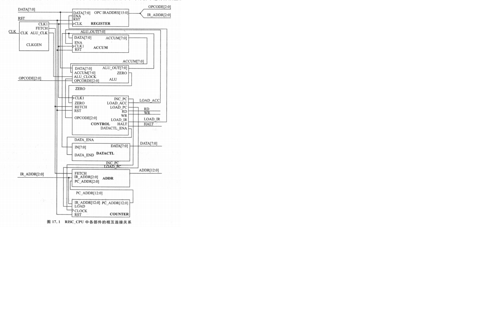
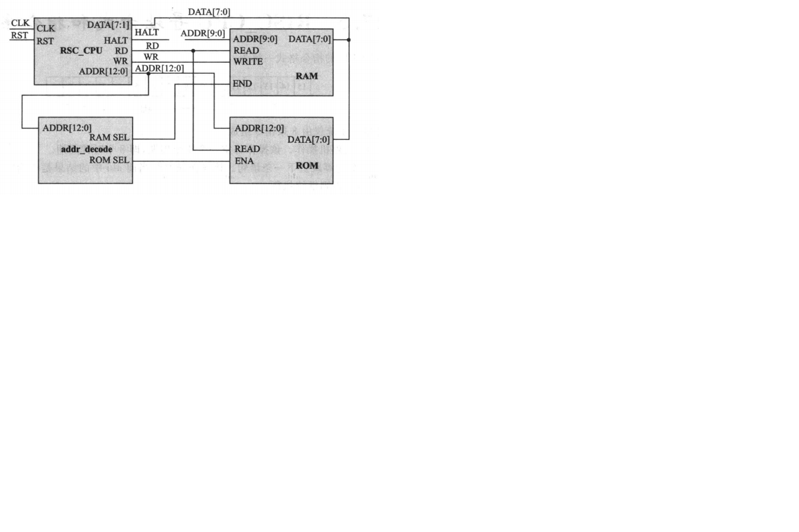

时钟发生器：clk作用于指令寄存器，累加器，状态控制器，alu_ena作用于控制算数逻辑运算单元的操作
指令寄存器：寄存指令，**注意使能信号**即不是所有时钟信号沿来的时候都进行寄存来自总线的数据，因为总线有时传输指令，有时传输数据。
**注**：总线的概念，寻址空间的概念
累加器：用于存放当前的结果，当ena收到来自CPU状态控制器load_acc信号时，在clk上升沿收到来自*数据总线*的数据
算术运算器：根据操作码实现不同的运算
数据控制器：控制累加器数据输出，data_ena控制是否将累加器的数据使用数据总线输出到ram或端口，**任何使用数据总线传输的数据都要加控制信号**
地址多路器：选择输出的地址是PC(程序计数)地址还是数据/端口地址。每个指令周期的前4个时钟周期用于从ROM中读取指令，输出的是PC地址，后4个时钟周期用于对RAM或端口的读写，地址由指令给出
